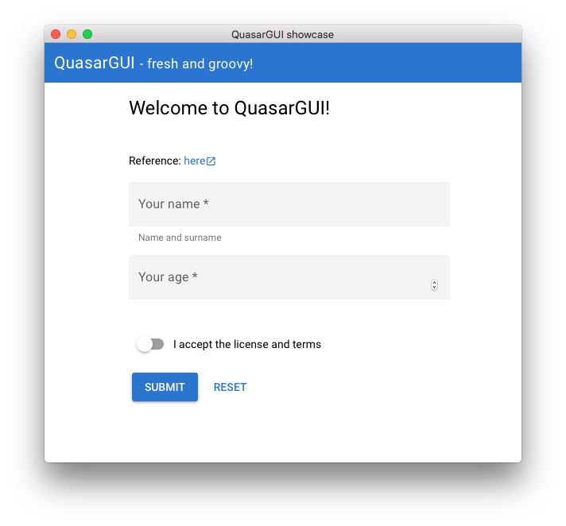
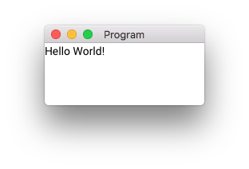
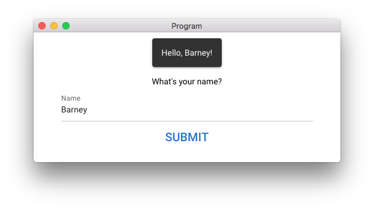

#QuasarGUI
A user-friendly package for making awesome-looking desktop apps in Python.

Read the [full documentation](https://barnabasszabolcs.github.io/pyquasargui/quickstart/) here.

## Compatibility:

 - It runs flawlessly on Mac, 10.13.6+ (High Sierra or newer).
 - Linux compatibility: unknown, it depends on `cefpython3`'s and `pywebview`'s linux compatibility.
 - Windows compatibility: compatible with Windows 7, on Windows 10 `pywebview` did not work (2021-07-30).

## Usage:

This GUI library creates a window with a html view, in which Quasar Vue system is running. But don't worry, you can build up everything in python.

A window is built up of Component's and the components correspond to components described in (https://quasar.dev/vue-components/). Quasar is very well-documented and so it makes this project well-documented. From Quasar's help page you can use all props, classes, as well as you can easily customize the look of your Components using CSS.

You can react to user events using callbacks. (See: simple greeter app.)

###Hello world



```python3
import quasargui
from quasargui import *

layout = QLayout(["Hello World!"])
quasargui.run(layout)
```

###Simple greeter app

This app demonstrates how you can build up a simple form and use the form's data to run your code.



```python
import quasargui
from quasargui import Div, QInput, QButton, Model

name = Model()


def display_notification():
    layout.api.plugins.notify(message=f'Hello, {name.value}!')


layout = Div(
    styles={'max-width': '30em', 'margin-left': 'auto', 'margin-right': 'auto'},
    classes='q-mt-xl q-pt-lg text-center',
    children=[
        "What's your name?",
        QInput('Name', name),
        QButton('Submit', classes='text-primary',
                props={'size': 'lg'},
                events={'click': display_notification}
                )
    ])

quasargui.run(layout)  # Shows a window with the layout.
```
If you're interested how you can easily style buttons, check out

 * [Quasar's button api](https://quasar.dev/vue-components/button#qbtn-api)
 * [Quasar's input api](https://quasar.dev/vue-components/input#qinput-api)

From Quasar's page
 * any prop can be added to the corresponding quasargui component's props,
 * any classes can be added to classes and
 * any events can be added to events (without the @).

Dynamic props (on Quasar's page it is in ":prop" format) can be added using `Model`:
```python
from quasargui import *
my_value = Model('my str')
props={'string-prop': my_value}
```
Model works with any json-like type (str, bool, int, list, dict).

[See further examples in the examples folder.](examples)


### Installation:

At the moment this project is just a demo, featuring only a few components,
but it will be available on pip soon.

#### Dependencies: 

 * pywebview

### License:

MIT license


## Concepts of quasargui

Quasargui package closely follows the structure of Quasar, and you can also easily integrate any Vue component. The most important is to have handy defaults so you only need to write code when you want to customize.

The GUI builds up itself from `Component`'s and `Model`'s. To understand the logic of all components, let's examine a typical component.
```python
from quasargui import *
loading = Model(False)
def connect(): loading.value = True; print('Connect button clicked')

button = QButton(
    label='Connect',
    classes='q-ma-md',
    styles={'opacity': 0.8},
    props={'no-caps': True, 'loading': loading},
    events={'click': connect},
    children=[
        Slot('loading', [QSpinner(appearance='dots')])
    ])
```
In Vue, `button`'s definition corresponds to:
```html
<q-button
    label="Connect"
    class="q-ma-md"
    styles="opacity: 0.8"
    :no-caps="true"
    :loading="loading"
    @click="connect"
>
    <template v-slot:loading>
        <q-spinner-dots></q-spinner-dots>
    </template>
</q-button>
```
The common attributes of a `Component` are:
- *classes*: custom css classes, separated by space (html class attribute)
- *styles*: custom styles applied (html style attribute)
- *props*: all the quasar attrs (no-caps is a constant attribute, loading is an  attribute that is bound to a variable.)
- *events*: all the quasar "@" attrs. Events call the assigned callback in python.
- *children*: are list of the html children, everything that is between <q-button>...</q-button>. So, *slots* are also set here with `Slot('slot-name', [...list of children...])`. 

**Convenience:** Argument order follows convenience. Some commonly used props of a component such as `label` are given a "shortcut" parameter, and even put into first position, so you don't need to type out its name.   
Writing `QButton('OK')` is the same as `QButton(props={'label': 'OK'})` but more concise. 

**Type system:** All arguments are typed so you can catch most of the errors with a type-checker. This is the benefit of having props and events separated.

**Formulas**: If there's a formula in a Vue attribute, you need to use `Computed`.
If the component *requires* JavaScript function to be used, you can resort to `JSRaw`.
```python
from quasargui import *
x, y = Model(2), Model(3)
QInput(
    label=Computed(lambda x, y: f'{x} + {y} =', x, y), 
    props={'rules': JSRaw("[value => value>0 || 'Enter a positive number']")}
)
```

**Vue directives:** If a component works with `v-model` then you can access it via the `model` parameter. Other `v-`'s such as `v-if` can be accessed as props. 
Additionally, **prop modifiers** are simply put after the prop name as in Vue. 

**Computed values:** `Model` and `Computed` work like an excel sheet, where `Model` is the normal data, `Computed` are the formulas. Everytime a `Model` changes, it updates all its dependent `Computed` values. You can also hook into `Model`'s changes by adding a callback:
```python
from quasargui import *
model = Model()
model.add_callback(lambda: print('model changed'))
```

### Convenience classes

For all the typical Python data-types quasargui package has a Component, designed to provide a convenient input.

 - basic types: InputStr, InputInt, InputFloat, InputBool, InputList
 - list: InputList -  tags, multi-select or checkboxes.
 - choices: InputChoice - radio, button-group or select.
 - file path: InputFile.
 - datatime (data, time and datatime): InputDate, InputTime, InputDataTime are  input fields with calendar/clock popup.
 - hex color: InputColor


#### Overriding defaults

Some other components try and guess your intent (QDrawer adds a sandwich menu button for itself, QHeader wraps its arguments into QToolbar&ToolbarTitle if necessary.)
 
However, every automatic guess and default can be overridden. Some have parameter to disable (eg. automatic sandwich menu for QDrawer).
In components that have defaults, you can override default with `del YourComponent.defaults['props']['your-prop']`. 

To remove a slot, add `RemoveSlot('name')` to `children`.


## Detailed documentation

Read the [full documentation](https://barnabasszabolcs.github.io/pyquasargui/quickstart/) here.