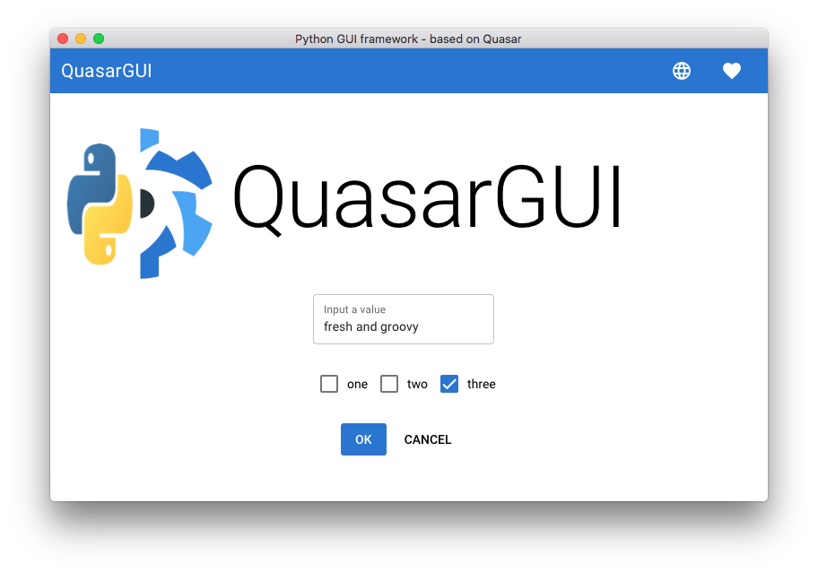
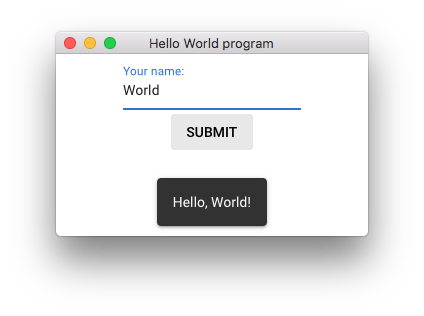
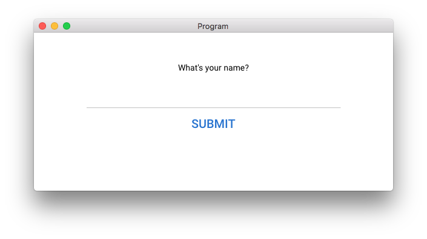

# QuasarGUI

Quasargui ports Quasar to make modern GUI apps in Python.

You may want to use QuasarGUI because

1. it uses a stable framework, [Quasar](https://quasar.dev).
2. you can enjoy two-way binding,
3. still, your code stays Python-only. 

## Hello World example

```python
from quasargui import *

name = Model('')
layout = Rows([
    QInput('Your name:', name),
    QButton('Submit', events={
        'click': lambda: layout.notify(
            message=f'Hello, {name.value}!', position='bottom')
    })
])
run(layout, title='Hello World program')
```
If you type "World" and click "Submit", this program outputs



How does this work?     
When you change `QInput`, `name`'s value gets updated automatically. So, when you click on `QButton`, `layout.notify` is called with the correct name, `'World'`. 

`Rows`, `QInput`, and `QButton` are rendered as Vue components and HTML elements. You can communicate with components via `Model`'s. `Model`'s are two-way bound to the window.

## Quickstart

Can't wait to get started? Read the *[quickstart guide](quickstart.md)*.
If you come from a Vue background, check out the [comparison between Vue and Quasargui](quickstart.md#comparing-vuequasar-and-quasargui). 

## List of examples

A range of examples can be found in the [examples directory on GitHub][github_examples].
These examples we describe in detail.

## Hello World with styling

Components can be easily changed by adding a few css classes and styles.

You can see the [reference of the classes on quasar.dev](https://quasar.dev/style/spacing#introduction]), for spacing, positioning, typography, visibility and breakpoints and [shadows](https://quasar.dev/style/shadows).


=== "Screenshot"
    

=== "Code"
    ```python
    from quasargui import *
    
    name = Model('')
    layout = Div(
        styles={
            'max-width': '30em',
            'margin-left': 'auto',
            'margin-right': 'auto',
        },
        classes='q-mt-xl text-center',
        children=[
            "What's your name?",
            QInput(model=name),
            QButton('Submit', 
                    classes='text-primary',
                    props={'unelevated': True, 'size': 'lg'},
                    events={
                        'click': lambda: layout.notify(
                            f'Hello, {name.value}!', position='bottom')
            })
        ])
    ```

## Requirements

This project requires `pywebgui` and Python 3.5+.
```
pip install pywebgui
``` 
In turn, `pywebgui` uses native renderers or Qt whichever it is available. (eg. on Mac the native renderer is cocoa)

### System compatibility:

 - It runs flawlessly on Mac, 10.13.6+ (High Sierra or newer).
 - Linux compatibility: unknown, it depends on `cefpython3`'s and `pywebview`'s linux compatibility.
 - Windows compatibility: compatible with Windows 7 but on Windows 10 `pywebview` did not work (2021-07-30).

We plan to replace pywebview dependency with `cefpython3` and `wxPython WebView`.

## Installation

```
pip install quasargui
```

## Support

[Contact me][github_me] on Github.

## License

Quasargui is licensed under MIT license.

[github_examples]: https://github.com/BarnabasSzabolcs/pyquasargui/tree/develop/examples
[github_me]: https://github.com/BarnabasSzabolcs/