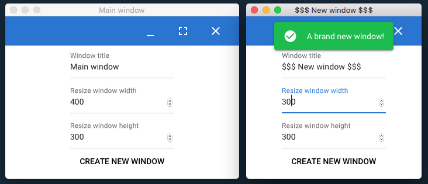

# Quickstart

This page takes you through concepts of Quasargui.

If you haven't yet installed Quasargui, you can install Quasargui by
    
    pip install quasargui

Now, you're ready to run our first example.

## The simplest window

The simplest possible window only takes 3 lines of code.

=== "screenshot"
    <figure>
    
    </figure>

=== "source"
    ```python
    from quasargui import *
    layout = Rows(children=['This is', '<i>the simplest</i>', 'window!'])
    run(layout, title='The simplest', size=[200, 100])
    ```

The important parts of the code:

  1. `run` runs the GUI - and the program stays at this line until all the windows are closed.
  2. `run` always takes a `Component`, the main component to display. In this case the component is `Rows`. 
  3. `children` can be a list of `Component`'s and `str`'s and some other types that we'll discuss later. 
  4. The `children` strings accept html code, so simple formats such as `<i>` and `<b>` can be comfortably written directly. For more complex cases, use components such as `Link`, `Heading`, etc.

Let's move on to a more advanced code that also can be used as a boilerplate for your app.

## Starter code

To quickly get a nice window layout, you can use the code of the window below.

=== "screenshot"
    <figure>
    
    </figure>

=== "source"
    ```python
    import quasargui
    from quasargui import *
    
    loading = Model(True)
    
    
    def set_loaded():
        loading.value = False
    
    
    layout = QLayout([
        QHeader([
            QToolbar([QToolbarTitle([
                QIcon('ramen_dining', 'lg', classes='q-mx-md'),
                'Your Program Title'
            ])])
        ]),
        QDrawer([
            '<b>'
            'Your drawer'
            '</b>'
            '<div class="q-mt-md">'
            'for your parameters.'
            '</div>'
        ]),
        QDrawer(side=QDrawer.RIGHT, show=False, children=[
            '<b>'
            'Your right drawer.'
            '</b>'
            '<div class="q-mt-md">'
            'If you delete a drawer,its sandwich menu disappears'
            '</div>'
        ]),
        QPage([
            'Here comes the contents of your QPage'
        ]),
        v_show(
            loading,
            QFooter(children=[
                'Here is your footer that is only displayed if loading.value == True',
                QButton('ok', events={'click': toggle(loading)})
            ])
        )
    ])
    
    quasargui.run(layout, title='Program title')
    ```

The things you need to know about this window:

`QLayout`, `QDrawer`, etc. are all `Component`s that correspond to **Vue** components. In particular, we use [Quasar][quasardoc]'s professional-looking components - hence the name Quasargui. All the components you see on the Quasar documentation page, are imported into Quasargui, wrapped into `Component`'s.

The first parameter of a `Component` is `children`, so you don't have to type constantly `children=`.   
Note that `QButton`'s first parameter is *not* children but `label` since typically you want to add a label to a button and not children (which is also still possible of course...).

Quasargui uses Python's typing system, so if you use an IDE you can always check with typing system if you're using Quasargui correctly.

To make changes on the window, we use `Model`'s, like `loading` in this example. A `Model` provides "two-way binding" between your code and the GUI. This means that every change to a `Model`'s value is reflected in the GUI and every user input changes the `Model`'s value.

## Vue vs. Quasargui

If you have experience with Vue, this section shows you how concepts in Vue are transferred to Quasargui.  
The transfer from Vue is natural since under the hood Quasargui builds up a Vue/Quasar webpage and interacts with it through pywebview's api.

For example 
```python
ok_label = Model('ok')
Div(children=[
    'text', 
    QButton(props={'label': ok_label})
])
``` 
roughly results in 
```html
<div>
    text
    <q-button :label='data[1]' />
</div>
```

So, if you look into [quasar's documentation][quasardoc], all Vue components have their `Component` counterpart in Quasargui, with the same name. As an example, `<q-button/>` corresponds to `QButton`.

### Vue components to Component parameters

Among a `Component`'s constructor's parameters,

* `children` corresponds to html-style children.
* `props` corresponds to `props` (eg. `label="ok"`, `:label="data[1]"`),
* `events` corresponds to Vue events (eg. `@click`)
* `classes` corresponds to `class` attribute.
* `style` corresponds to `style` attribute.

Additionally, we have defined some shorthand parameters for frequently used props (such as `label` in case of QButton).

Directives are defined as functions. `v_show` and other `v_*` functions correspond to `v-*` directives. Only `v-model` gets special treatment, it is always accessible as the `model` parameter of a `ComponentWithModel`.

Any `Model` corresponds to Vue data that is defined on the Vue app. There is also `Computed` that works similar to 'computed'  in Vue.

### Vue slots in Quasargui

In components, Vue's slots can be accessed as `Slot('slot-name', [...children...])`. Since `Slot` is a `Component`, it also has props, events, styles and classes.

=== "screenshot"
    <figure>
    
    <figcaption>
    The map sign of the input field is defined in a slot.
    </figcaption>
    </figure>
=== "source"
    ```python
    from quasargui import *
    
    layout = QInput(
        classes='q-ma-lg',
        label='Your city',
        children=[
            Slot('prepend', [
                QIcon('place')
            ])
        ])
    
    run(layout, title='slots example')
    ```

#### Scoped slots

Scoped slots can be accessed a little-bit differently. Since scoped slots are meant as a template, in python we express them as functions, `Slot('slot-name', lambda props: [... children...])`. In this formula `props` is a `PropVar` that behaves just like a `Model`.

=== "screenshot"
    <figure>
    
    <figcaption>
    This example is the Quasargui variant of Quasar's [tree example](https://quasar.dev/vue-components/tree#customize-content) where items in the tree view have customized *default-header* and *default-body*.
    </figcaption>
    </figure>
=== "source"
    ```python
    from quasargui import *
    
    customize = Model([
        {
            'label': 'Satisfied customers',
            'header': 'root',
            'children': [
                {
                    'label': 'Good food',
                    'icon': 'restaurant_menu',
                    'header': 'generic',
                    'children': [
                        {
                            'label': 'Quality ingredients',
                            'header': 'generic',
                            'body': 'story',
                            'story': 'Lorem ipsum dolor sit amet.'
                        },
                        {
                            'label': 'Good recipe',
                            'body': 'story',
                            'story': 'A Congressman works with his equally conniving wife to exact revenge '
                                     'on the people who betrayed him.'
                        }
                    ]
                },
                {
                    'label': 'Good service',
                    'header': 'generic',
                    'body': 'toggle',
                    'caption': 'Why are we as consumers so captivated by stories of great customer service? '
                               'Perhaps it is because...',
                    'enabled': False,
                    'children': [
                        {'label': 'Prompt attention'},
                        {'label': 'Professional waiter'}
                    ]
                },
                {
                    'label': 'Pleasant surroundings',
                    'children': [
                        {'label': 'Happy atmosphere'},
                        {'label': 'Good table presentation', 'header': 'generic'},
                        {'label': 'Pleasing decor'}
                    ]
                }
            ]
        }
    ])
    
    layout = QTree(
        props={
            'nodes': customize,
            'node-key': 'label',
            'default-expand-all': True
        }, children=[
            Slot('default-header', lambda prop: [
                Div(classes='row items-center', children=[
                    QIcon(
                        name=Computed(lambda ic: ic or 'share', prop['node']['icon']),
                        size='28px',
                        color='orange',
                        classes='q-mr-sm'),
                    Div(classes='text-weight-bold text-primary', children=[
                        prop['node']['label']
                    ])
                ])
            ]),
            Slot('default-body', lambda prop: [
                v_if(prop['node']['story'], Div([
                    CustomComponent('span', classes='text-weight-bold', children=['This node has a story']),
                    ': ',
                    prop['node']['story']
                ])),
                v_else(
                    CustomComponent('span', classes='text-weight-light text-black', children=[
                        'This is some default content.'
                    ])
                )
            ])
        ])
    
    run(layout, title='Scoped slot demo')
    ```

## Model and Computed

In Quasargui `Model` and `Computed` enable `Component`'s to change dynamically. They are the most convenient way to handle complex user interaction.    
To see the interactions with `Model` and `Computed`, consider the following example:

=== "screenshot"
    <figure>
    
    <figcaption>
    If you type a number into *a* or *b*,     
    the window displays "is even" or "is odd",     
    depending on the parity of *a+b*
    </figcaption>
    </figure>

=== "source"
    ```python
    from quasargui import *
    
    a = Model(0)
    b = Model(0)
    even = Computed(lambda x, y: (x+y) % 2 == 0, a, b)
    odd = Computed(lambda x: not x, even)
    
    layout = Rows([
        QInput('a', model=a),
        '+',
        QInput('b', model=b),
        v_if(even, Div(['is even'])),
        v_if(odd, Div(['is odd'])),
    ])
    
    run(layout)
    ```

In the example above `even` and `odd` are computed from the value of `a` and `b`. 
Although a `QInput`'s model value is usually `str`, in this example it is automatically converted to `int`, since `a` and `b` has initial value of type `int`.

In general, a `Model` accepts any combination of basic python types (including `list` and `dict`). If you want to use other python classes, you'll need to write your custom logic to convert a Model's value into json-compatible values.

To access the value of a `Model` or a `Computed`, use the `.value` property. It is a read/write property for `Model`'s and read-only for `Computed`. If you want to be more explicit, you can also use `.set_value()`.

### Watching changes

If you want to execute code when a `Model` gets a certain value, you just call `add_callback` on that `Model`. 

=== "screenshot"
    <figure>
    
    <figcaption>
    When the conditions are accepted, a notification pops up.
    </figcaption>
    </figure>

=== "source"
    ```python
    from quasargui import *
    
    def notify_if_accepted():
        if accepted.value:
            accepted.api.plugins.notify('Thanks for accepting!')
    
    accepted = Model(False)
    accepted.add_callback(notify_if_accepted)    
    layout = InputBool("Accept conditions", accepted)
    run(layout)
    ```

You can add a callback anytime of course, even after a component is added to the window. 

## Events

Events can be defined on `Components` using the `events` property at construction time. Events that can be defined are specific for a `Component`. If you want to check the state of the system at the event, access your `Model` and `Computed` values.

=== "screenshot"
    <figure>
    
    <figcaption>
    When the user clicks the button, a notification pops up.
    </figcaption>
    </figure>

=== "source"
    ```python
    from quasargui import *
    layout = QButton('Click me', events={
        'click': lambda: layout.api.plugins.notify("I've got clicked!")})
    run(layout)
    ```

## Notifications, dialogs

Quasargui offers a range of notification and dialog options, wrapping [Quasar's plugins][quasardocplugins]. You can access most Quasar plugins via `your_component.api.plugins` or `your_model.api.plugins`. 

=== "📷 main screen"
    <figure>
    
    <figcaption>
    An extensive example. To check out all the dialogs and grid menus, you can run this example if you copy-paste it into your Python prompt.
    </figcaption>
    </figure>

=== "📷 dark mode"
    <figure>
    
    <figcaption>
    Dark mode can be a breeze. The switch is in the top-right corner.
    </figcaption>
    </figure>

=== "📷 success notification"
    <figure>
    
    <figcaption>
    Notifications can be easily configured (use `your_component.api.plugins.notify()`, with setting keyword arguments besides message). See [Quasar documentation of options][quasardocnotifyapi]; on QuasarConfOptions you can use any option as a keyword argument to `notify()`.  
    </figcaption>
    </figure>

=== "📷 options dialog"
    <figure>
    
    <figcaption>
    One type of dialog is options dialog. You can have a simple yes-no prompt, a string value input prompt and other custom options.
    </figcaption>
    </figure>

=== "📷 grid menu"
    <figure>
    
    <figcaption>
    A grid menu can nicely de-clog your app.
    </figcaption>
    </figure>

=== "⌨️ python source"
    ```python
    from quasargui import *


    def show_notification(message):
        layout.notify(message=message, position='top-right', group=False, timeout=1500)
    
    
    def show_success():
        layout.api.plugins.notify(message='This is a success!', caption='Just now', type='positive', icon='done')
    
    
    dialog_events = {
        'ok': lambda data: show_notification('OK clicked, data={}'.format(json.dumps(data))),
        'cancel': lambda: show_notification('Cancel clicked'),
        'dismiss': lambda: show_notification('Dialog dismissed'),
    }
    
    
    def show_alert():
        layout.api.plugins.dialog(props={'title': 'Alert', 'message': 'Some message'}, events=dialog_events)
    
    
    def show_confirm():
        layout.api.plugins.dialog(props={
            'title': 'Confirm',
            'message': 'Would you like to turn on the wifi?',
            'cancel': True,
            'persistent': True
        }, events=dialog_events)
    
    
    def show_prompt():
        layout.api.plugins.dialog(props={
            'title': 'Prompt',
            'message': 'What is your name?',
            'prompt': {'model': '', 'type': 'text'},
            'cancel': True,
            'persistent': True
        }, events=dialog_events)
    
    
    def show_options():
        layout.api.plugins.dialog(props={
            'title': 'Options',
            'message': 'Choose an option',
            'options': {
                'model': 'opt1',
                'type': 'radio',
                'items': [
                    {'label': 'Option 1', 'value': 'opt1', 'color': 'secondary'},
                    {'label': 'Option 2', 'value': 'opt2'},
                    {'label': 'Option 3', 'value': 'opt3'}
                ]
            },
            'cancel': True,
            'persistent': True
        }, events=dialog_events)
    
    
    def show_bottom_sheet(grid: bool):
        layout.api.plugins.bottom_sheet(props={
            'message': 'Bottom Sheet message',
            'grid': grid,
            'actions': [
                {'label': 'Drive', 'id': 'drive', 'img': 'https://cdn.quasar.dev/img/logo_drive_128px.png'},
                {'label': 'Keep', 'id': 'keep', 'img': 'https://cdn.quasar.dev/img/logo_keep_128px.png'},
                {'label': 'Google Hangouts', 'id': 'calendar', 'img': 'https://cdn.quasar.dev/img/logo_hangouts_128px.png'},
                {},
                {'label': 'Share', 'icon': 'share', 'id': 'share'},
                {'label': 'Upload', 'icon': 'cloud_upload', 'color': 'primary', 'id': 'upload'},
                {},
                {'label': 'John', 'avatar': 'https://cdn.quasar.dev/img/boy-avatar.png', 'id': 'john'}
            ]
    
        }, events=dialog_events)
    
    
    dark_mode = Model(False)
    dark_mode.add_callback(
        lambda: layout.api.plugins.dark(dark_mode.value)
    )
    
    layout = QLayout([
        QHeader([QToolbar([
            QToolbarTitle([
                QIcon('announcement', 'lg', classes='q-mx-md'),
                'Dialogs'
            ]),
            QSpace(),
            QButton(
                label=Computed(lambda dark: 'light mode' if dark else 'dark mode', dark_mode),
                icon=Computed(lambda dark: 'light_mode' if dark else 'dark_mode', dark_mode),
                props={'stretch': True},
                events={'click': toggle(dark_mode)}
            )
        ])]),
        QPage([Rows(classes='q-py-xl', children=[
    
            QButton('show a success notification', events={'click': show_success}),
            QButton('show an alert', events={'click': show_alert}),
            QButton('show a confirmation', events={'click': show_confirm}),
            QButton('show a prompt', events={'click': show_prompt}),
            QButton('show options', events={'click': show_options}),
            QButton('show a grid menu', events={'click': lambda: show_bottom_sheet(grid=True)}),
            QButton('show a list menu', events={'click': lambda: show_bottom_sheet(grid=False)}),
    
            Div(classes='q-mt-xl', children=[
                'See even more examples at ',
                Link('Quasar dialog documentation',
                     'https://quasar.dev/quasar-plugins/dialog#predefined')])
        ])])
    ])
    
    run(layout, title='Dialogs demonstration', debug=True)

    ```

In general, in [Quasar's plugins][quasardocplugins] documentation, if you see `notify({options})` you can expect to write in Python `my_component.api.plugins.notify(**options)`.

Note that not all plugins are wrapped (because many plugins do not make sense in a desktop app) and some plugins work a little bit different. Look up `QuasarPlugins` in the `Quasargui` code to see all the implemented plugins.

## Custom styles, defaults

Once you start working with Quasargui, you will probably want to create your own styling. Luckily, Quasar is pretty flexible, offers a range of [styling classes][quasardocclasses] (eg. `'q-mt-xl'` means margin top should be extra large) and `Q*` components have lots of props (eg. `QButton(props={'glossy': True})`).

It can be a bit of a hustle though to set the same options again and again. So, defaults to the rescue!


=== "screenshot"
    <figure>
    
    <figcaption>
    An alternative styling for form elements. Check out the code to see how styles can be set.
    </figcaption>
    </figure>
=== "source"
    ```python
    from quasargui import *
    
    QButton.defaults['props'] = {
        'glossy': True,
        'color': 'orange',
        'rounded': True
    }
    QInput.defaults['props'] = {
        'outlined': True,
        'rounded': True
    }
    
    layout = Rows(classes='q-mt-lg q-gutter-md', children=[
        Columns([QButton('one'), QButton('two'), QButton('oranje!')]),
        QInput('me is outlined')
    ])
    
    run(layout, title='We likes glossy')
    ```

## Window access

Quasargui's `run(layout)` command automatically produces a window for you. You can access this window through `layout.api` - in fact, `your_component.api` and `your_model.api` points to the same api *after* the component or the model is attached to a window. If you want to modify the window's properties, access system dialogs or create new windows, you can find these functionality as `api`'s (`quasargui.main.Api`'s) functions.

So, in the following sections we'll basically walk through `quasargui.main.Api`.

### Menu

Menu can be added using `run(menu=menu_definition)` where `menu_definition` can look like 
```python
[{
    'title': 'Edit', 
    'children': [
        {'title': 'Copy', 'key': 'c', 'action': copy_cb},
        {'title': 'Paste', 'key': 'p', 'action': paste_cb}
    ]
}]
``` 
There are other subtleties such as defining a menu that is specific to a certain operations system. These are covered in the documentation of `Api`.

=== "📷 menu on mac"
    <figure>
    
    <figcaption>
    An example menu on Mac - check out the other screenshots for other systems.
    </figcaption>
    </figure>
=== "📷 menu on other systems"
    <figure>
    
    <figcaption>
    The menu on other systems is implemented using Quasargui `Component`'s, mimicking a Windows menu.
    </figcaption>
    </figure>
=== "⌨️ python source"
    ```python
    from quasargui import *
    
    menu = [
        {'title': 'Top Action', 'action': lambda: layout.notify("Top Action"), 'key': 't'},
        {'title': 'Custom menu 1', 'children': [
            {'title': 'Action 1', 'action': lambda: layout.notify("Hello 1"), 'key': 'b'},
            {'title': 'Action 2', 'action': lambda: layout.notify("Hello 2"), 'key': 'd'},
            None,  # separator
            {'title': 'Submenu', 'children': [
                {'title': 'Action 3', 'action': lambda: layout.notify("Hello 3")},
                {'title': 'Submenu 2', 'children': [
                    {'title': 'Submenu goes forever:)', 'children': [
                        {'title': 'Action 5', 'action': lambda: layout.notify("Hello 5")}
                    ]},
                    {'title': 'Action 4', 'action': lambda: layout.notify("Hello 4")}
                ]},
            ]},
        ]},
    ]
    
    layout = Rows([])
    run(layout, menu=menu)
    ```

If you want to dynamically change the menu, you can do that using `Api`'s `set_menu()` command.

### Window operations

To access window operations, we use `Api`'s methods. You can access the api instance pointing to the window by a `Component` that is already mounted to a window (`your_component.api`) or a `Model` that is mounted to a window (`your_model.api`). To minimize, fullscreen or close a window, call 
`.minimize_window()`, `.toggle_fullscreen()` or `.close_window()`. To change the title, call `.set_title('New title')`. 

The standard file/folder/save dialogs can be accessed the same way - see the code of this example below.

=== "screenshot"
    <figure>
    
    <figcaption>
    Copy the code of this example into your Python prompt to see window properties in action.
    </figcaption>
    </figure>
=== "source"
    ```python
    from quasargui import Model, QLayout, QHeader, QPage, QToolbar, QSpace, QButton, QInput, Rows, TrueFalse, toggle
    from quasargui.main import run
    
    
    title_model = Model('Your title goes here')
    title_model.add_callback(
        lambda: title_model.api.set_window_title(title_model.value),
        immediate=True
    )
    is_fullscreen = Model(False)
    width = Model(400)
    width.add_callback(
        lambda: width.api.resize_window((width.value, None)) if 300 <= width.value <= 1000 else None,
        immediate=True
    )
    height = Model(500)
    height.add_callback(
        lambda: height.api.resize_window((None, height.value)) if 300 <= height.value <= 1000 else None,
        immediate=True
    )
    
    
    def toggle_fullscreen():
        layout.api.toggle_fullscreen()
        is_fullscreen.value = not is_fullscreen.value
    
    
    layout = QLayout([
        QHeader([QToolbar([
            QSpace(),
            QButton(icon='minimize',
                    props={'stretch': True},
                    events={'click': lambda: layout.api.minimize_window()}),
            QButton(icon=TrueFalse('fullscreen_exit', 'fullscreen', is_fullscreen),
                    props={'stretch': True},
                    events={'click': toggle_fullscreen}),
            QButton(icon='close',
                    props={'stretch': True},
                    events={'click': lambda: layout.api.close_window()}),
        ])]),
        QPage([
            Rows([
                QInput('Window title', title_model),
                QInput('Resize window width', width, type='number'),
                QInput('Resize window height', height, type='number'),
                QButton(
                    'Show file dialog',
                    events={
                        'click': lambda: layout.notify('You chose: {}'.format(
                            layout.api.show_open_dialog()))
                    }),
                QButton(
                    'Show folder dialog',
                    events={
                        'click': lambda: layout.notify('You chose: {}'.format(
                            layout.api.show_folder_dialog()))
                    }),
                QButton(
                    'Show save dialog',
                    events={
                        'click': lambda: layout.notify('You chose: {}'.format(
                            layout.api.show_save_dialog()))
                    }),
            ])
        ])
    ])
    
    run(layout, size=(400, 500))
    ```

Frameless windows are also possible.

=== "screenshot"
    <figure>
    
    <figcaption>
    This toolbar is a frameless window.
    </figcaption>
    </figure>
=== "source"
    ```python
    from quasargui import *
    props = {'dense': True}
    
    QButton.defaults['props'] = {
        'dense': True,
        'unelevated': True
    }
    Columns.defaults['classes'] = ''
    Rows.defaults['classes'] = ''
    
    
    layout = QLayout(children=[
        QPage([
            QBar(props={'dense': True}, classes='q-pr-xs', children=[
                QSpace(),
                QButton(icon='minimize',
                        props=props,
                        events={'click': lambda: layout.api.minimize_window()}),
                QButton(icon='close',
                        props=props,
                        events={'click': lambda: layout.api.close_window()}),
            ]),
            Rows([
                Columns([QButton(icon='language'), QButton(icon='favorite')]),
                Columns([QButton(icon='send'), QButton(icon='help')]),
            ])
        ])
    ])
    
    run(layout, frameless=True, size=(64, 100), resizable=False)
    ```

### Multiple windows

You can manage multiple windows. In that case the main rule of thumb is that each `Component`, `Model` and `Computed` can belong to only *one* window.    
So, it is best to create your layout and models via a factory function.

=== "screenshot"
    <figure>
    
    <figcaption>
    This example creates a new random-sized window when the user clicks 'create window'. Setting window title (that is a model) affects only its own window. 
    </figcaption>
    </figure>
=== "source"
    ```python
    from random import randint
    from time import sleep
    
    from quasargui import Model, QLayout, QHeader, QPage, QToolbar, QSpace, QButton, QInput, Rows, TrueFalse
    from quasargui.main import create_window, run
    
    
    def create_new_window():
        layout = create_layout('New window')
        create_window(layout, position=(randint(1, 100), randint(1, 100)), size=(400, 500))
        sleep(0.5)
        layout.notify('A brand new window!', type='positive', timeout=200000)
    
    
    def close_window(layout):
        layout.api.close_window()
        print('The window is closed but the app still runs')
    
    
    def toggle_fullscreen(layout, model):
        model.value = not model.value
        layout.api.toggle_fullscreen()
    
    
    def create_layout(title):
        title_model = Model(title)
        title_model.add_callback(
            lambda: title_model.api.set_window_title(title_model.value),
            immediate=True
        )
        is_fullscreen = Model(False)
        width = Model(400)
        width.add_callback(
            lambda: width.api.resize_window((width.value, None)) if 300 <= width.value <= 1000 else None,
            immediate=True
        )
        height = Model(300)
        height.add_callback(
            lambda: height.api.resize_window((None, height.value)) if 300 <= height.value <= 1000 else None,
            immediate=True
        )
    
        layout = QLayout([
            QHeader([QToolbar([
                QSpace(),
                QButton(icon='minimize',
                        props={'stretch': True},
                        events={'click': lambda: layout.api.minimize_window()}),
                QButton(icon=TrueFalse('fullscreen_exit', 'fullscreen', is_fullscreen),
                        props={'stretch': True},
                        events={'click': lambda: toggle_fullscreen(layout, is_fullscreen)}),
                QButton(icon='close',
                        props={'stretch': True},
                        events={'click': lambda: close_window(layout)}),
            ])]),
            QPage([
                Rows([
                    QInput('Window title', title_model),
                    QInput('Resize window width', width, type='number'),
                    QInput('Resize window height', height, type='number'),
                    QButton('Create new window', events={'click': create_new_window}),
               ])
            ])
        ])
        return layout
    
    
    main_layout = create_layout('Main window')
    run(main_layout, size=(400, 300))
    ```

## Most important components

In this part we'll go through the most important components.
If you're interested in seeing all components, go to the [components list](components.md).

### Layout components 

The window (or `run()` function) can take any component as `component`, still it is recommended to use `QLayout` with `QHeader`, `QPage` and `QFooter` as children, and optionally `QDrawer`'s. This leads to a standard layout where you can put your most important functions into `QHeader`, as `QButton` (*'stretch'* prop is recommended). QHeader's background and foreground can be set using 'q-*' classes, using `styles={'background': '#abc', 'color': '#fff'}` or adding your own stylesheet, pushing the path of your css file to `your_component.style_sources` or calling `your_component.api.import_styles()` after your component is mounted. 

Note that adding `QHeader` and `QFooter` to `QLayout` is entirely optional.

### Rows and Columns

If you want the classic vertical or horizontal layout, use `Rows` or `Columns`. These result in a html "flex" layout which means that Columns will wrap automatically if the window is not wide enough.

TODO: example - also handle the case when the use does not want the columns to wrap.

### Form elements

You have access to a range of form elements. There are the Quasar form components (starting with Q, in `quasargui.quasar_form` module). 

TODO: example - some basic list of quasar form-components in a window

Also, there are form elements *by input value type*. These elements are in `quasargui.quasar_form_improved` module and are named according to the input value type, eg. `InputStr`, `InputBool`, etc. The idea is to automatically get a combination of controls that is set up correctly. You can get an apropriate appearance for your input, and later you can refine it, choosing from one of its available `appearance`. Eg. an `InputChoice` can be a radio, a series of pushable buttons, or a select dropdown. Or, if you allow multiple choices, you can get checkbox, toggles, tags input or a multi-choice select. If you don't choose one, the control is determined based on the number of available choices.

TODO: example - InputChoice with different settings

There's `InputTime`, `InputDate` and `InputDateTime` that are implementations of Quasar's recommendations on data-time input, with all the conversions between Python and the GUI taken care of (remember that `date`, `time` and `datetime` is a special class that is not a basic type.)

TODO: example - date-time with datetime open.

#### Form validation

You can validate form components right when the user inputs a value - but for snappier action you need to add raw javascript to handle simple field validations, using `JSRaw`.

TODO: example - form_validation.py (with JSRaw)

You can also stick to submit-time validation, in this case you need to set up a `Model` for errors.

TODO: example - submit-time validation


[quasardoc]: https://quasar.dev
[quasardocplugins]: https://quasar.dev/quasar-plugins/
[quasardocnotifyapi]: https://quasar.dev/quasar-plugins/notify#notify-api
[quasardocclasses]: https://quasar.dev/style/spacing