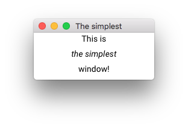
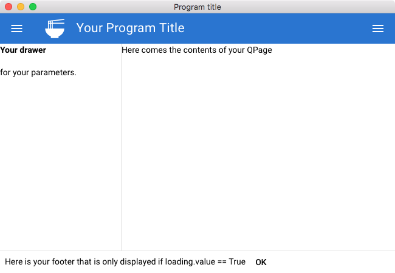
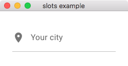
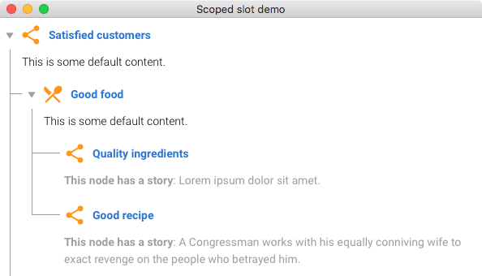
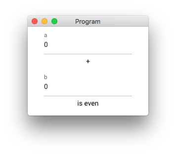

# Quickstart

This page takes you through concepts of Quasargui. The examples you can also use as boilerplate, so you can quickly get up and running with Quasargui.

If you haven't yet installed Quasargui, you can install Quasargui by
    
    pip install quasargui

Now, you're ready to run our first example.

## The simplest window

The simplest possible window only takes 3 lines of code.

=== "screenshot"
    

=== "source"
    ```python
    from quasargui import *
    layout = Rows(children=['This is', '<i>the simplest</i>', 'window!'])
    run(layout, title='The simplest', size=[200, 100])
    ```

The important parts of the code:

  1. `run` runs the GUI - and the program stays at this line until all the windows are closed.
  2. `run` always takes a `Component`, the main component to display. In this case the component is `Rows`. 
  3. `children` can be a list of `Component`'s and `str`'s and some other types that we'll discuss later. 
  4. The `children` strings accept html code, so simple formats such as `<i>` and `<b>` can be comfortably written directly. For more complex cases, use components such as `Link`, `Heading`, etc.

Let's move on to a more advanced code that also can be used as a starter.

## Starter code

To quickly get a nice window layout, you can use the code of the window below.

=== "screenshot"
    

=== "source"
    ```python
    from quasargui import *
    
    loading = Model(True)
    
    layout = QLayout([
        QHeader([
            QToolbar([QToolbarTitle([
                QIcon('ramen_dining', 'lg', classes='q-mx-md'),
                'Your Program Title'
            ])])
        ]),
        QDrawer([
            '<b>Your drawer</b><div class="q-mt-md">for your parameters.</div>'
        ]),
        QDrawer(side=QDrawer.RIGHT, show=False, children=[
            '<b>Your right drawer.</b> If you delete a drawer, its sandwich menu disappears'
        ]),
        QPage([
            'Here comes the contents of your QPage'
        ]),
        v_show(
            loading,
            QFooter(children=[
                'Here is your footer that is only displayed if loading.value == True',
                QButton('ok', events={'click': toggle(loading)})
            ]))
    ])
    run(layout, title='Program title')
    ```

The things you need to know about this window:

`QLayout`, `QDrawer`, etc. are all `Component`s that correspond to **Vue** components. In particular, we use [Quasar][quasardoc]'s components - hence the name Quasargui. All the components you see on the Quasar documentation page, you can use here as a components, all of them are wrapped into a `Component`.

The first parameter of a `Component` is usually `children`. `children` comes first so you don't have to type constantly `children=`.   
Note that `QButton`'s first parameter is *not* children but `label`, since typically you want to add a label to a button and not children (which is still possible of course...).

Quasargui's api uses python's typing system, so if you use an IDE you can check with typing system if you're using Quasargui correctly.

To make changes on the window, we use `Model`'s, like `loading`. `Model` provides a "two-way binding" between your code and the GUI which means that every change is reflected in the GUI and every user input changes the `Model`'s value.

## Vue (Quasar) vs Quasargui

Under the hood, Quasargui builds up a Vue/Quasar webpage and interacts with it through pywebview's api.

For example, 
```python
ok_label = Model('ok')
Div(children=[
    'text', 
    QButton(props={'label': ok_label})
])
``` 
roughly results in 
```html
<div>
    text
    <q-button :label='data[1]' />
</div>
```

So, if you look into [quasar's documentation][quasardoc], `Component`'s correspond to Vue components.   
Among a `Component` constructor's parameters,

* `children` correspond to html-style children.
* `props` corresponds to `props` (eg. `label="ok"`, `:label="data[1]"`),
* `events` corresponds to Vue events (eg. `@click`)
* `classes` corresponds to `class` attribute.
* `style` corresponds to `style` attribute.

Additionally, we have defined some shorthand parameters for frequently used props (such as `label` in case of QButton).

Directives are defined as functions. `v_show` and other `v_*` functions correspond to `v-` directives. Only `v-model` is special, it is always accessible as the `model` parameter of a `ComponentWithModel`.

`Model` corresponds to Vue data that is defined on the Vue app. There is also `Computed` that works similar to `Model`.

### Slots

In components, Vue's slots can be accessed as `Slot('slot-name', [...children...])`. For example:

=== "screenshot"
    

=== "source"
    ```python
    from quasargui import *
    
    layout = QInput(
        classes='q-ma-lg',
        label='Your city',
        children=[
            Slot('prepend', [
                QIcon('place')
            ])
        ])
    
    run(layout, title='slots example')
    ```

Scoped-slots can be accessed a little-bit differently. Since scoped slots are meant as a template, in python we express them as functions, `Slot('slot-name', lambda props: [... children...])`. Here props is a `PropVar` that behaves just like `Model`.

=== "screenshot"
    <figure>
    
    <figcaption>
    This example is the Quasargui variant of Quasar's [tree example](https://quasar.dev/vue-components/tree#customize-content) where items in the tree view have customized *default-header* and *default-body*.
    </figcaption>
    </figure>
=== "source"
    ```python
    from quasargui import *
    
    customize = Model([
        {
            'label': 'Satisfied customers',
            'header': 'root',
            'children': [
                {
                    'label': 'Good food',
                    'icon': 'restaurant_menu',
                    'header': 'generic',
                    'children': [
                        {
                            'label': 'Quality ingredients',
                            'header': 'generic',
                            'body': 'story',
                            'story': 'Lorem ipsum dolor sit amet.'
                        },
                        {
                            'label': 'Good recipe',
                            'body': 'story',
                            'story': 'A Congressman works with his equally conniving wife to exact revenge '
                                     'on the people who betrayed him.'
                        }
                    ]
                },
                {
                    'label': 'Good service',
                    'header': 'generic',
                    'body': 'toggle',
                    'caption': 'Why are we as consumers so captivated by stories of great customer service? '
                               'Perhaps it is because...',
                    'enabled': False,
                    'children': [
                        {'label': 'Prompt attention'},
                        {'label': 'Professional waiter'}
                    ]
                },
                {
                    'label': 'Pleasant surroundings',
                    'children': [
                        {'label': 'Happy atmosphere'},
                        {'label': 'Good table presentation', 'header': 'generic'},
                        {'label': 'Pleasing decor'}
                    ]
                }
            ]
        }
    ])
    
    layout = QTree(
        props={
            'nodes': customize,
            'node-key': 'label',
            'default-expand-all': True
        }, children=[
            Slot('default-header', lambda prop: [
                Div(classes='row items-center', children=[
                    QIcon(
                        name=Computed(lambda ic: ic or 'share', prop['node']['icon']),
                        size='28px',
                        color='orange',
                        classes='q-mr-sm'),
                    Div(classes='text-weight-bold text-primary', children=[
                        prop['node']['label']
                    ])
                ])
            ]),
            Slot('default-body', lambda prop: [
                v_if(prop['node']['story'], Div([
                    CustomComponent('span', classes='text-weight-bold', children=['This node has a story']),
                    ': ',
                    prop['node']['story']
                ])),
                v_else(
                    CustomComponent('span', classes='text-weight-light text-black', children=[
                        'This is some default content.'
                    ])
                )
            ])
        ])
    
    run(layout, title='Scoped slot demo')

    ```

## Model and Computed

To see the interactions with `Model` and `Computed`, consider the following example:

=== "screenshot"
    <figure>
    
    <figcaption>
    If you type a number into *a* or *b*,     
    the window displays "is even" or "is odd"     
    depending on the parity of *a+b*
    </figcaption>
    </figure>

=== "source"
    ```python
    from quasargui import *
    
    a = Model(0)
    b = Model(0)
    even = Computed(lambda x, y: (x+y) % 2 == 0, a, b)
    odd = Computed(lambda x: not x, even)
    
    layout = Rows([
        QInput('a', model=a),
        '+',
        QInput('b', model=b),
        v_if(even, Div(['is even'])),
        v_if(odd, Div(['is odd'])),
    ])
    
    run(layout)
    ```

In this example, `even` and `odd` are computed from the value of `a` and `b`. A `Model`'s value is automatically passed as `int`, `float`, `str`, etc. corresponding to the type of the initial value. In general, a `Model` accepts any combination of basic python types (including `list` and `dict`), but if you want to use other python classes, you'll need to write your custom logic to convert a Model's value into json-compatible values.

## Default props and classes

TODO: it is easier to define defaults than to add props again and again... (code without defaults vs code with defaults)

## Events

TODO: QButton click event example.

Events can be defined on `Components`

## Watching for change in Models and Computed
TODO: add_callback example

```python
model.add_callback()
```

## Notifications and dialogs

TODO: example - dialogs.py


## Window access
### Menu

TODO: example - menu.py

### Minimize, fullscreen, close
### System dialogs (eg. file dialog)
### Multiple windows

## Basic widgets

### QLayout, QPage, QDrawer...

TODO: describe these components - and the smart automatisms - and say that a QLayout can be used with only a QPage, too.

### Rows, Columns, Div


### Form elements

#### Form validation
TODO: example - form_validation.py


[quasardoc]: https://quasar.dev
